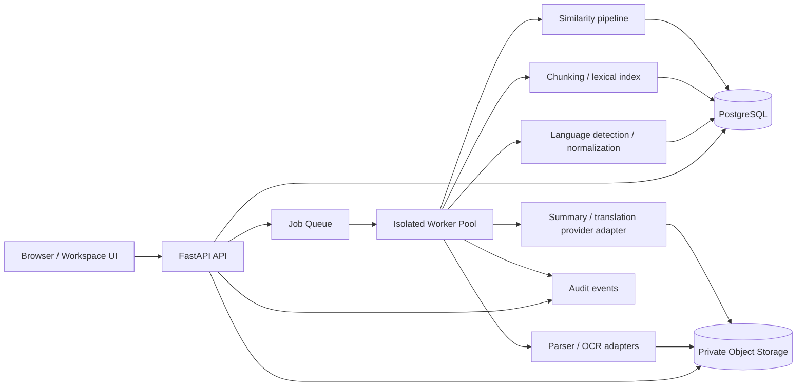

# DocuScope — Proposed Architecture

## System view

## Deployment shape
Start with a modular monolith API plus separately running workers. Split services only when scale, security isolation, or operational ownership justifies the added complexity.

## Main boundaries
- Frontend: presentation, interaction state and client-side validation; no authorization decisions or secrets.
- API: authentication, authorization, input validation, job orchestration, signed download authorization.
- Database: workspace-scoped metadata, state, match evidence and audit events.
- Object storage: private originals and generated artifacts.
- Workers: untrusted-file parsing, OCR, chunking, matching and generation under resource limits.
- Provider adapters: OCR/LLM/translation interfaces with explicit timeout, cost, data-handling and retry policies.

## Core data entities
See the architecture skill for the expanded model. Every record containing a document, job, artifact, match or export must be associated with a workspace or have a verifiable path to one. Store source version IDs and algorithm/provider versions with derived artifacts.

## Processing pipeline
1. Upload to private quarantine.
2. Validate size, signature, checksum and format.
3. Scan where feasible and accept/reject.
4. Create durable job.
5. Extract text/metadata; OCR scanned pages.
6. Detect language by page/chunk.
7. Normalize for analysis while retaining display text and offsets.
8. Chunk with page/section references.
9. Index and run requested analysis.
10. Persist evidence and generated artifact.
11. Update job state and notify/poll client.
12. Apply retention/deletion policy to all derived artifacts.

## Important implementation decisions
- Keep originals immutable.
- Use idempotency keys for job creation and stable output keys per job attempt.
- Use an outbox or equivalent pattern so database state and queue publication cannot silently diverge.
- Keep long-running work out of request handlers.
- Apply bounded concurrency, timeouts and backoff.
- Use provider interfaces so engines can be swapped.
- Keep tenant scope in database queries, search, caches, object access and job polling.
- Version extraction, normalization, chunking, similarity and prompt templates.

## Initial database constraints
- Unique `(workspace_id, idempotency_key)` where appropriate.
- Unique `(document_id, version_number)`.
- Foreign keys for workspace and artifact relationships.
- Index workspace + creation time for document/job listing.
- Index job status for worker polling/operations.
- Store match offsets and chunk IDs, not only an opaque aggregate score.
- Do not store raw provider credentials or signed URLs.

## Observability
Capture request/job correlation IDs, stage timings, page counts, retry count, provider/model version, cost estimate and error code. Redact filenames if sensitive under workspace policy, and never log document text, prompts containing raw text, access tokens or signed URLs.
